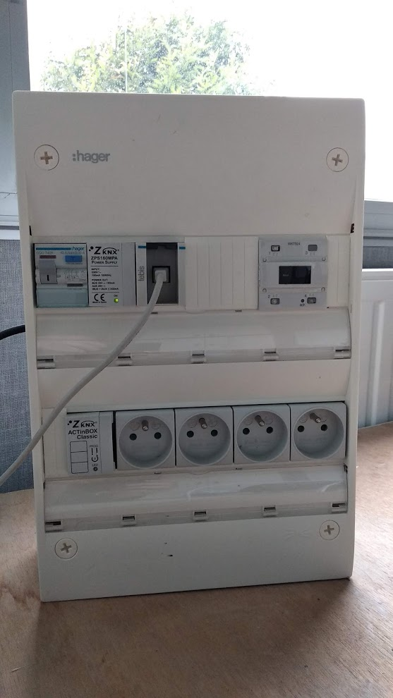
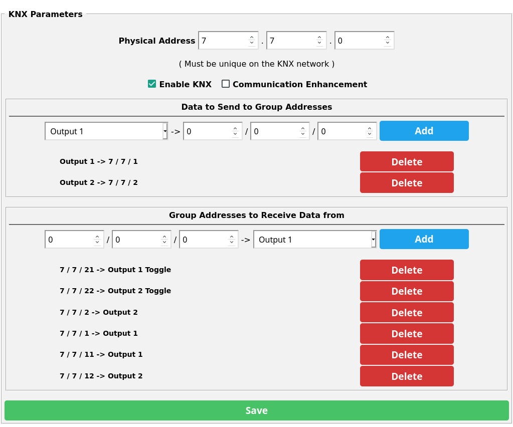
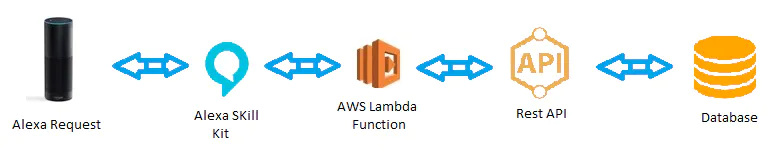

# Protocoles domotiques IP vs CPL, radios, filaires.. 

Présentation d'un échantillon de protocoles domotiques (principalement sur IP).

## Glossaire :
- Device : Elément domotique => sonde de T°, luminaire, volet...
- Hub : Matériel qui fournit une API pour discuter avec un protocole spécifique
- Gateway : Logiciel qui permet l'interopérabilité entre différents protocoles

---

# Quelques exemples de protocoles radios 
- [Edisio](https://www.edisio.com/)
- RTS (Somfy)
- X2D / X3D (Deltadore)
- [Zigbee](https://zigbeealliance.org/fr/)
- [Zwave](http://z-wavealliance.org)

# Quelques exemples filaires
- X2D (CPL par Deltadore)
- modbus
- [KNX](https://www.knx.org) (TP, PL, RF, IP)

---

# Les protocoles domotiques sur IP

## Le but
Permettre l'interopabilité des diverses solutions au niveau IP, et non au niveau application.

## Au début des années 2000

- HTTP divers & variés
- UPnP : SSDP + SOAP ([Publi de 2004][1]) 
- xAP / xPL : Broadcast (à la soupe) + JSON (like)

[1]: https://www.researchgate.net/publication/225412057_Networking_and_Communication_in_Smart_Home_for_People_with_Disabilities 

---

# KNX IP

## Rappels KNX
- TP / PL / RF / IP
- Programmation des noeuds avec ETS
- 'Routeur' IP, USB (cf photo), DIY

## IP
- Support logiciel par [KNXD](https://github.com/knxd/knxd)
- Protocole utilisant le mulicast
- Trames binaires (appelés télégrammes) 
- READ/WRITE de datapoints
- Sécurité : KNX Secure (AES128)
--- 

# KNX IP 
Exemple d'utilisation avec [Tasmota](https://github.com/arendst/Tasmota)

Extrait :
https://redmine.telecom-bretagne.eu/projects/xaal/repository/entry/code/Python/branches/0.7/devices/protocols/KNX/xaal/knx/knxrouter.py#L45

---

# Yeelight (luminaires Xiaomi) [⭐](https://www.yeelight.com/)

## Protocole local
- Découverte via SSDP
- Commande via socket UDP (unicast)
- Trames encodées en JSON
- Polling pour l'état
- Sécurité : protocole local désactivé par défaut

## Cloud
- Cloud => Application : API REST 
- Cloud => Luminaire ? (websocket ?)
---

# Aqara  (capteur / actionneur Xiaomi/Aqara) [⭐](https://www.aqara.com/en/products.html)

Attention, plusieurs versions du hub, des capteurs.

## Protocole local
- Découverte via mutlticast (non standard, non SSDP)
- Evénements via multicast sur un second port (en clair)
- Commandes via socket UDP sur le device (hub, ou prises)
- Chiffrées (AES), token tournant fourni par device (hub) toutes les 5sec
- Clée de chiffrement par device (hub)
- Trames encodées en JSON
- Trame de heartbeat

=> Très fiable

---

# Aqara (suite)
Extrait : 
https://redmine.telecom-bretagne.eu/projects/xaal/repository/entry/code/Python/branches/0.7/devices/protocols/Aqara/xaal/aqara/devices.py#L303

## Cloud
- Cloud => Application : HTTP
- Cloud => Hub : MQTT ?? (obligatoire sinon il crie)
---

# Tuya (toutes les autres chinoiseries) [⭐](https://www.banggood.com/fr/search/tuya.html?from=nav) 

## Protocole local
- TCP (mono-connexion)
- Clé de chiffrement par device (AES)
- Pas de découverte
- Ping/Pong sinon timeout
- Trames encodées en JSON (avec des dps)

## Cloud 
- Cloud => Application : REST (cassée)
- Cloud => Device : MQTT modifié avec un chiffrement faible
- Une faille de l'implémentation MQTT permet de flasher un firmware alternatif :)
---

# HomeKit [⭐](https://www.apple.com/fr/ios/home/accessories/)
## Protocole local
- HTTP + SSL
- Cauchemard en cuisine goût pomme
- Appairage par code PIN (figé dans 99% des cas)
- Appairage unique (c'est l'élément que je préfère)

## Cloud
- Pas de cloud ;)
- Enfin, le cloud permet de cloner le pairing d'une appli à l'autre, mais c'est tout. 
- et encore, uniquement sur les produits Apple

--- 

# MQTT
L'anti-protocole !
Contrairement à tous les protocoles précédents, MQTT introduit un acteur tierce : le broker. Le broker permet de relayer les messages entre les devices (pub/sub). La communication n'est plus entre devices.

- Conçu pour le NAT
- SPOF (tout ce que l'on veut éviter à la maison)
- TCP + TLS
- Dans la vraie vie => TLS pas implémentable (taille de RAM, pb de certificat)
- Une version UDP existe, mais pas adoptée à cause de DTLS
- Il n'y a pas de convention de nommage ('%topic%/%prefix%/ ou l'inverse, ou un mix en insérant le mot -patate-)
- Topic simple et payload rudimentaire, pas de soucis, mettons du JSON !
---

# MQTT (suite)
Mais il a un avantage principal:
- Simplicité enfantine, 0 connaissance nécessaire
- Il existe des tones de bindings (même en JS)

### Il est donc utilisé partout :)
- [Sonoff](https://sonoff.tech/)
- [HomeAssistant](https://www.home-assistant.io/)
- Tasmota
- Wled
- Y a même un [shell over MQTT](https://github.com/jpmens/mqtt-launcher) ou presque
---

# xAAL [⭐](http://recherche.imt-atlantique.fr/xaal/)
- Projet de recherche IMT depuis 2012
- Première release 2014
- Multicast (découverte, évènements, action)
- Chiffré avec [ChaCha20-Poly1305](https://en.wikipedia.org/wiki/Poly1305)
- CBOR (depuis la 0.7, avant JSON)

=> TP au prochain épisode ? :)

---

# Synthèse

|        	| KNX  	| Yeelight 	| Aqara  |  Tuya    | HomeKit | MQTT    | xAAL  |
|---	    |---	|---	    |---	 |---       |---      |---      |---    |
|Payload    |  Bin 	|   JSON   	|  JSON  |   JSON   |  JSON   |  what?  | CBOR  |
|Typage	    |  ++  	|    0     	|   0	 |    0     |   +     |  what?  | ++    |
|Sécurité  	|  + 	|    --    	|   +	 |    ++    |   ++    |    0    | ++    |
|Simplicité |  + 	|    ++    	|   --	 |    +     |   --    |   +++   | ++    |
|Fiabilité  | +++	|    0    	|   ++	 |    0+    |   --    |   +     | ++    |
|Ecosystème | ++	|    +    	|   ++	 |    ++    |   +     |   +     | --    |
|DIY        | + 	|    NA    	|   NA	 |    ?     |   HB    |   ++    | ++    |
---

# Google Assistant & Alexa
utilisent uniquement les connecteurs clouds

## Quelques exceptions
- Alexa gère le protocole Wemo en natif (UPnP)
- Certains echos intègrent une pile Zigbee
- Google Home gère le HomeKit en natif
---

# Google Assistant & Alexa (suite)

|               	| KNX  	| Yeelight 	| Aqara  |  Tuya    | HomeKit | MQTT    | xAAL |
|---	            |---	|---	    |---	 |---       |---      |---      |---   | 
|Google Assistant   | $$ 	|    +    	|   +	 |    +     |   +     |   NA    | NA   |
|Alexa              | $$ 	|    +    	|   +	 |    +     |   NA    |   NA    | --   |

Intégration DIY complexe :
- Passage par un tier payant comme [Nabu Casa](https://www.nabucasa.com)
- Hack divers et variés : 
    - FauMo
    - Hue
